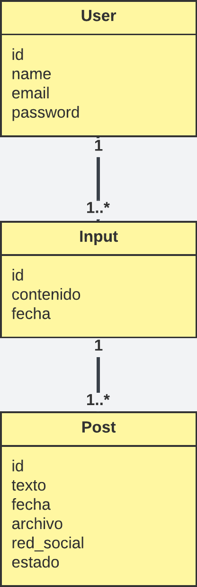

# Investigación de APIs y Selección de Stack

## Parte 1: Investigación de APIs

### Meta API (Facebook + Instagram)

#### Proceso de creación de app de desarrollador

[Ingresar al enlace](https://developers.facebook.com/apps/creation)

1. Dar nombre a la aplicación que no contenga la palabra Facebook ni Instagram

2. Proporcionar un correo electronico

3. En los casos de uso filtrar por `Others` y seleccionar `Other`

4. Seleccionar el tipo: **Business**

5. Crear aplicación

#### Requisitos para crear app de desarrollador

- Crear cuenta de Meta for Developers
  - Metodo de pago
  - Email
  - Numero de telefono

#### Permisos necesarios

**Instagram**

- El perfil que sera usado para subir las publicaciones deberá aceptar la invitación de probador, ingresando a su perfil > Ajustes > Aplicaciones y sitios web.

- El perfil debe ser de tipo empresarial

### LinkedIn Share API

#### Documentación de Share API

[¿ Como realizar una publicación en LinkedIn ?]()

```bash
curl -X POST "https://api.linkedin.com/v2/ugcPosts" \
     -H "Authorization: Bearer <access_token>" \
     -H "Content-Type: application/json" \
     -d '{
           "author": "urn:li:person:<profile_id>",
           "lifecycleState": "PUBLISHED",
           "specificContent": {
             "com.linkedin.ugc.ShareContent": {
               "shareCommentary": {
                 "text": "Hello World! This is my first Share on LinkedIn!"
               },
               "shareMediaCategory": "NONE"
             }
           },
           "visibility": {
             "com.linkedin.ugc.MemberNetworkVisibility": "PUBLIC"
           }
         }'
```

[¿ Como obtener el <profile_id> ?](https://learn.microsoft.com/en-us/linkedin/consumer/integrations/self-serve/sign-in-with-linkedin-v2#api-request-to-retreive-member-details)

Realizar la petición:

```bash
curl -X GET "https://api.linkedin.com/v2/userinfo" -H "Authorization: Bearer <access_token>" | jq
```

Retorna una respuesta como:

```json
{
  "sub": "<profile_id>",
  "email_verified": true,
  "name": "Niels Roy Chambi Gonzales",
  "locale": {
    "country": "ES",
    "language": "es"
  },
  "given_name": "Niels Roy",
  "family_name": "Chambi Gonzales",
  "email": "nielsroy8@gmail.com",
  "picture": "https://media.licdn.com/dms/image/v2/D4D03AQE5bawiNDCaqg/profile-displayphoto-shrink_100_100/profile-displayphoto-shrink_100_100/0/1669580997794?e=1764201600&v=beta&t=n_7bH7Ojy6qDIsTEoXkHCG7aqNKDEwmwNX26dXSUtjM"
}
```

#### Requisitos de acceso

1. Creación de una aplicación para LinkedIn
   - Pagina Empresarial de LinkdIn
   - Logotipo de la Aplicación
2. Token de acceso OAuth 2.0 del perfil de LinkedIn donde se subirán las publicaciones

[Enlace para obtener el Token de acceso](https://www.linkedin.com/developers/tools/oauth)

#### Limitaciones de publicación

<table>
    <tr>
        <th>Throttle Type</th>
        <th>Daily Request Limit</th>
    </tr>
    <tr>
        <td>Member</td>
        <td>150 Requests</td>
    </tr>
    <tr>
        <td>Application</td>
        <td>100,000 Requests</td>
    </tr>
</table>

**Límite de Miembro (Member):** Es el límite de solicitudes que se aplica a cada usuario individual que ha autenticado tu aplicación. Es decir, un solo usuario no puede hacer más de 150 solicitudes al día a través de tu app.

**Límite de Aplicación (Application):** Es el límite total para toda tu aplicación en su conjunto. Suma las solicitudes de todos tus usuarios. Tu aplicación, en total, no puede exceder las 100,000 solicitudes diarias, independientemente de cuántos usuarios tenga.

#### Formatos soportados

- Solo texto (usando `shareMediaCategory: "NONE"`)
- Artículos o URLs (usando `shareMediaCategory: "ARTICLE"`)
- Imagenes (usando `shareMediaCategory: "IMAGE"`)
- Videos (usando `shareMediaCategory: "VIDEO"`)

**Consideraciones para subir Imagenes y Videos:**

Para adjuntar una imagen o video a una publicación se deben seguir los siguientes pasos:

1. Registrar la imagen o video a publicar
2. Subir la imagen o video a LinkedIn
3. Realizar la publicación con la imagen o video

[Más detalles en la documentación oficial](https://learn.microsoft.com/es-mx/linkedin/consumer/integrations/self-serve/share-on-linkedin#create-an-image-or-video-share)

#### Fuentes

- [Sign In With LinkedIn](https://learn.microsoft.com/en-us/linkedin/consumer/integrations/self-serve/sign-in-with-linkedin-v2)

- [Share on LinkedIn](https://learn.microsoft.com/es-mx/linkedin/consumer/integrations/self-serve/share-on-linkedin)

- [Developers LinkedIn](https://developer.linkedin.com/)

### TikTok API

#### Documentación de Content Posting API

https://developers.tiktok.com/doc/content-posting-api-get-started

#### Limitaciones

1. Requiere registrar y verificar una aplicación para TikTok Developers

#### Requisitos de verificación de la aplicación para TikTok

1. **Para web:** URL de la Aplicación desplegada con certificado SSL
2. URL de los Terminos de Servicio
3. URL de las Politicas de Privacidad
4. Video con demostración del flujo donde se usarán los productos de TikTok en la aplicación
5. Icono de la aplicación en 1024px x 1024px, 5MB Max, JPEG, JPG o PNG
6. Nombre de la aplicación
7. Categoría de la aplicación
8. Descripción de que realiza la aplicación
9. Descripción de como cada producto usado de la API de TikTok es usada en la aplicación

#### Plan B si no es accesible para desarrollo académico


## Parte 2: Características de Redes Sociales

<table>
    <tr>
        <th>Red Social</th>
        <th>Max Chars</th>
        <th>Tono</th>
        <th>Hashtags</th>
        <th>Emojis</th>
        <th>Formato Especial</th>
        <th>Mejores Prácticas</th>
    </tr>
    <tr>
        <td>Facebook</td>
        <td>63,206</td>
        <td>Informativo, Comunitario, Conversacional.</td>
        <td>1-3. Menos importantes que en otras redes, pero útiles para categorizar.</td>
        <td>Usados para engagement y humanizar</td>
        <td>Texto, links, imagenes</td>
        <td>40-80 caracteres</td>
    </tr>
    <tr>
        <td>Instagram</td>
        <td>2,200</td>
        <td>Visual, Auténtico, Inspirador, Cercano</td>
        <td>5-11 (o más, hasta 30). Cruciales para descubrimiento (SEO).</td>
        <td>Usados para contexto y personalidad</td>
        <td>Stories, Carruseles</td>
        <td>El "gancho" debe estar en los primeros 125 caracteres</td>
    </tr>
    <tr>
        <td>LinkedIn</td>
        <td>3,000</td>
        <td>Profesional, Educativo, Liderazgo de opinión, Networking.</td>
        <td>3-5. Específicos de industria o tema.</td>
        <td>Usados con moderación y profesionalidad</td>
        <td>Artículos, Encuestas, Newsletters</td>
        <td>La longitud óptima para engagement es 300-1200 caracteres.</td>
    </tr>
    <tr>
        <td>TikTok</td>
        <td>2,200</td>
        <td>Entretenido, Humorístico, Auténtico, Rápido.</td>
        <td>3-5. Imprescindibles para tendencias y retos.</td>
        <td>Usados para engagement y contexto</td>
        <td>Video Vertical (9:16)</td>
        <td>Usar audio en tendencia, video en alta resolución (720p+), duración ideal 21-34 segundos</td>
    </tr>
    <tr>
        <td>WhatsApp</td>
        <td>700 (en Estados de solo texto)</td>
        <td>Personal, Directo, Urgente (efímero).</td>
        <td>No aplica. (No se usan para descubrimiento)</td>
        <td>Usados para comunicación personal</td>
        <td>Estados (desaparecen en 24h): Texto, Foto, Video (hasta 90 seg), GIF</td>
        <td>Ser conciso, usar espaciado para facilitar la lectura. El contenido debe ser valioso ya que es para una audiencia directa.</td>
    </tr>
</table>

## Parte 3: Selección de Modelo

<table>
    <tr>
        <th>Modelo</th>
        <th>Costo</th>
        <th>Latencia</th>
        <th>Calidad</th>
        <th>Accesibilidad</th>
    </tr>
    <tr>
        <td>Gemini 1.5 Pro, Flash</td>
        <td>Google AI Studio (Gratis)</td>
        <td>No esta diseñado para aplicaciones de chat en tiempo real</td>
        <td>En pruebas de referencia estándar (como MMLU, GPQA y MATH) compite o supera modelos como GPT-4o</td>
        <td>API Key</td>
    </tr>
    <tr>
        <td>Imagen 3</td>
        <td>Google CLoud Vertex AI (Pago por uso)</td>
        <td>2 a 7 segundos</td>
        <td>Produce imagenes fotorealistas y alto nivel de detalle</td>
        <td>API Key</td>
    </tr>
</table>

**Fuentes:**

- [Tabla de clasificación basada en preferencias de usuarios a ciegas](https://arena.lmsys.org/)

- [Informe Tecnico de Gemini 1.5](https://arxiv.org/abs/2403.05530)

## Parte 4: Propuesta de arquitectura

### Diagrama de arquitectura


### Stack Tecnológico elegido

#### Backend

- Framework: NestJS
- ORM: TypeORM

#### Frontend

- VueJS

#### Base de Datos

- PostgreSQL

### Diseño preliminar de base de datos




